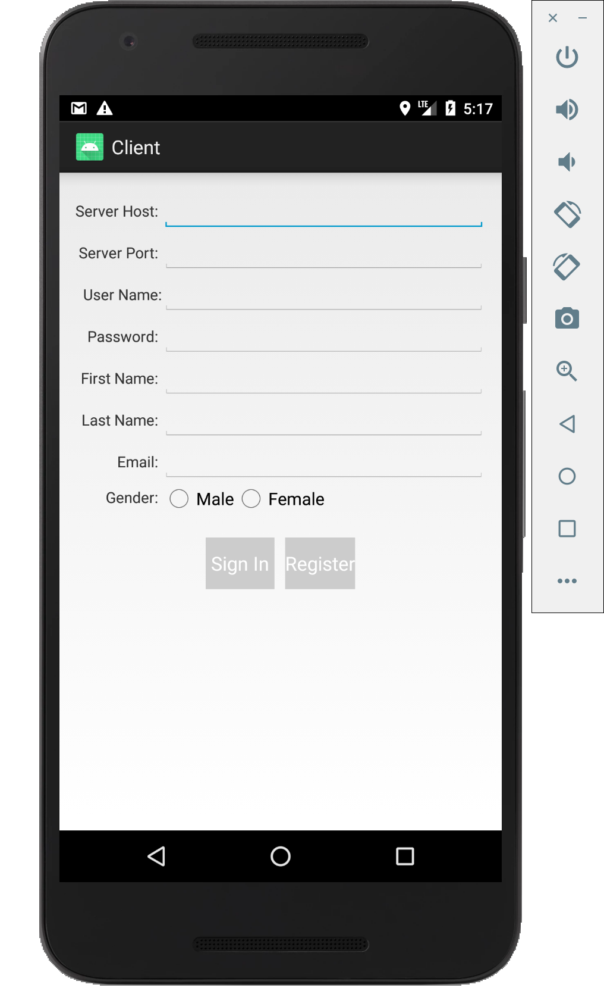
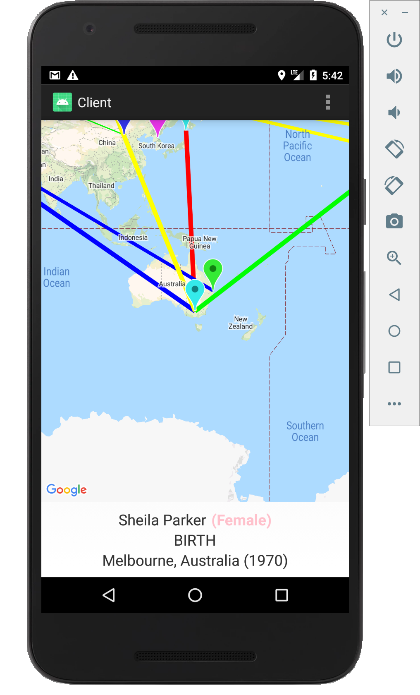
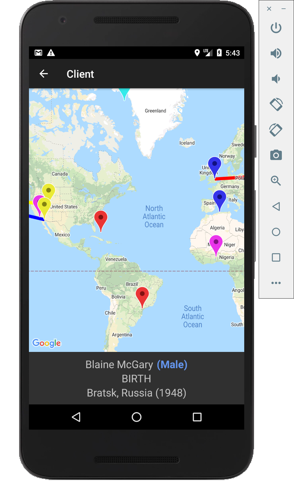
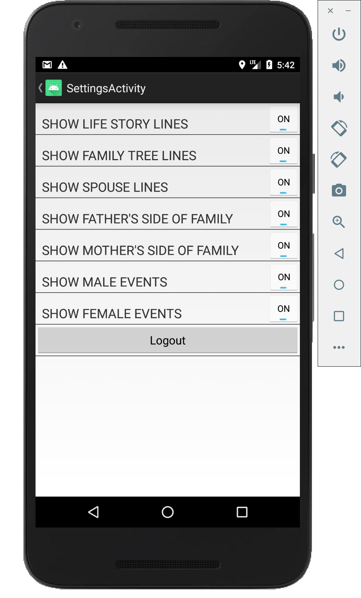

# android-app-family-history
This is the code for an android app that connects to my github project family-history-server.

A user must login (or register if they are new), and their data is stored on the server. Then, their family history data is displayed on a map of the world. Lines are drawn connecting reletives and the different sides of the family. You can search relatives, map out the events of a relative's life, and filter out the relatives displayed (based on side of the family, gender, etc).

Note: To use this application, you must use your own google maps api key. This needs to be added to the google_maps_api.xml file.

